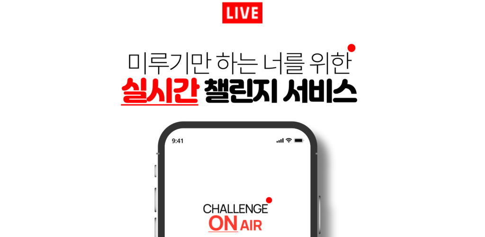
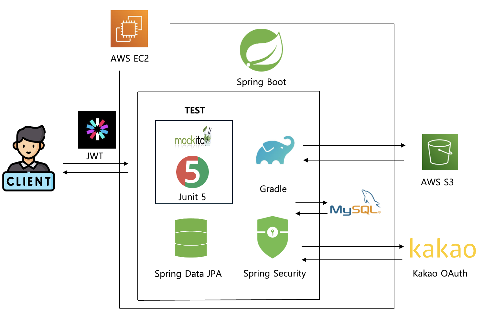
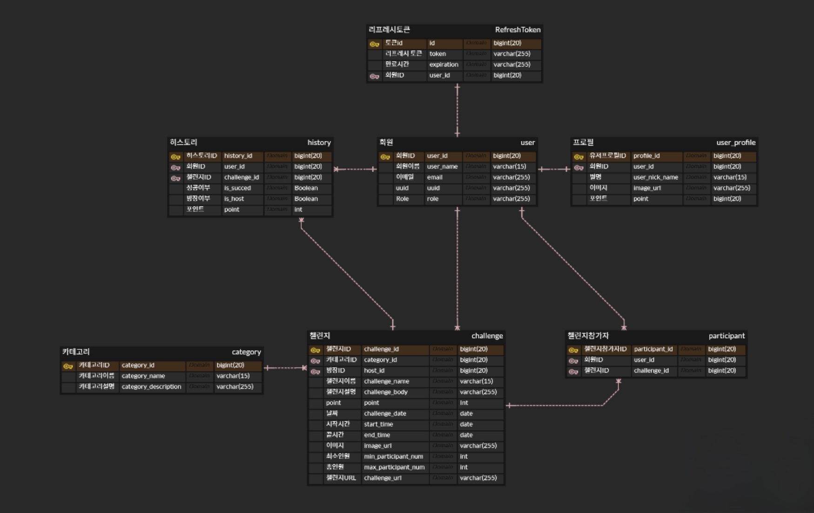
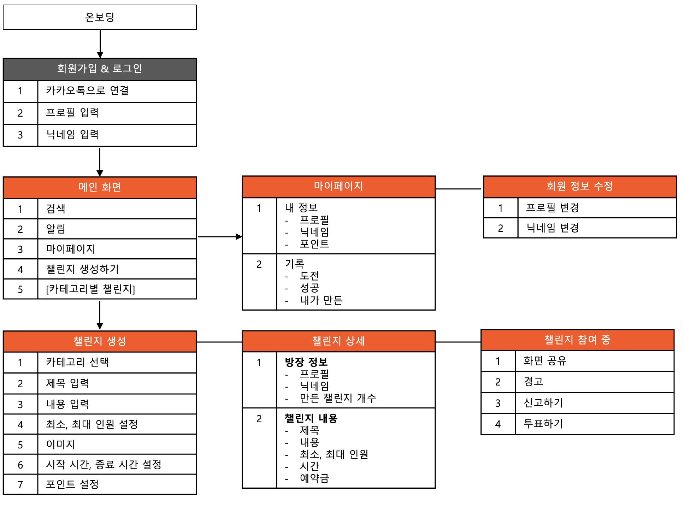

# 프로젝트 소개
## 개발 배경 및 필요성
### □ 개발 배경
많은 사람들이 더 생산적이고 자기주도적인 삶을 살기 위해 다양한 목표를 설정하지만, 목표를 지속해서 이루기는 쉽지 않습니다. 
특히 **혼자서 도전할 때**는 동기 부여와 책임감이 부족해 중도에 포기하기 쉽고, 성취를 공유할 사람조차 없어 성취감이 줄어드는 경우가 많습니다. 
**CHALLENGE ON AIR** 는 이러한 어려움을 극복하기 위해 실시간으로 목표를 공유하고, 같은 목표를 가진 사용자들이 서로 응원하고 동기 부여할 수 있는 플랫폼을 제공하고자 합니다.

### □ 개발 필요성
1. 개인의 목표 달성을 위한 강제성 필요성 
    - 혼자서 결심하고 도전하는 경우 결심이 쉽게 행동으로 이어지지 않습니다. **CHALLENGE ON AIR** 는 결심한 순간에 챌린지 참여를 예약할 수 있는 기능을 제공하여 강제성을 부여하고, 목표 달성을 위한 첫걸음을 쉽게 내딛을 수 있도록 돕습니다.

2. 상호작용을 통한 동기 부여와 책임감 고취 
   - 기존의 챌린지 앱들은 개인적인 사진 인증 방식이 많아, 목표에 대한 진정성이나 타인의 성과를 신뢰하기 어려운 경우가 많았습니다. **CHALLENGE ON AIR** 는 실시간 스트리밍을 통해 사용자들이 같은 목표를 동시에 도전하고 상호작용할 수 있어, 성취 과정의 신뢰도를 높이고 책임감을 강화할 수 있습니다.
   
3. 실시간 커뮤니티를 통한 참여 유도
   - 목표를 혼자 이루기는 어렵지만, 친구와 시간을 맞추기 어렵거나 특정 크루에 가입이 힘든 경우가 많습니다. **CHALLENGE ON AIR** 는 실시간으로 챌린지에 참여할 사람들을 모집하거나 기존의 챌린지에 참여할 수 있는 기능을 제공하여 사용자들이 손쉽게 도전에 동참할 수 있게 합니다.

### □ 동기 및 해결 방안
- 혼자서 도전하기 어려운 점을 극복하고 목표 달성의 재미와 책임감을 느낄 수 있도록, 실시간 스트리밍과 상호작용 기능을 추가하여 성취의 과정을 더 즐겁고 효율적으로 만들어줍니다.

## 개발 목표 및 주요 내용
### □ 개발 목표
**CHALLENGE ON AIR** 는 사용자가 실시간으로 목표를 도전하고 다른 사용자와 함께 상호작용을 통해 성취감을 얻을 수 있는 실시간 챌린지 플랫폼을 구축하는 것을 목표로 합니다. 아래의 주요 기능을 통해 목표를 달성하고자 합니다.

### □ 주요 내용
- 컨셉
  - **CHALLENGE ON AIR** 는 도전(Challenge)과 방송(Air)의 개념을 결합하여, 실시간으로 도전 과정을 공유하고 응원받는 시스템을 의미합니다. 
  - 메인 컬러로 신뢰와 에너지를 상징하는 블루와 레드를 조합해 **도전의 열정**과 **지속적인 성취**의 이미지를 전달합니다.

- 주요 기능
  1. 챌린지 예약 및 강제성 부여
     - 사용자가 결심한 순간에 챌린지 참여를 예약할 수 있는 기능을 제공하여, 결심을 행동으로 옮기기 쉽게 합니다.

  2. 실시간 스트리밍
     - 실시간 스트리밍을 통해 챌린지 인증을 수행하며, 타인의 도전 과정을 실시간으로 확인하고 응원할 수 있습니다.

## 기존 서비스 대비 차별성
### □ 기능 비교표
|             | 열품타 | 챌린저스 | Challenge ON Air |
|:-----------:|:-----:|:------:|:---------------:|
| 동기부여를 해주는가? |   O   |   O    |       O       |
| 실시간인가?      |   X   |   X    |       O       |
| 캠을 켜야 하는가?  |   X   |   X    |       O       |
| 상호작용이 가능한가? |   X   |   X    |       O       |

**CHALLENGE ON AIR** 는 기존 챌린지 앱과 달리 실시간 상호작용과 신뢰성 높은 인증 방식을 제공하여 사용자들이 서로의 목표에 대해 더 큰 동기와 책임감을 가질 수 있도록 돕는 차별화된 챌린지 플랫폼입니다.

---
# 상세설계
## 시스템 구성도
### □ 아키텍쳐

### □ ERD

## 사용 기술
| 번호 |       구분        |   버젼   |
|:--:|:---------------:|:------:|
| 1  |      MySQL      | 8.0.33 |
| 2  |    Java JDK     | 21.0.4 |
| 3  |       JWT       | 0.12.3 |
| 4  |   Spring Boot   | 3.3.3  |
| 5  | Spring Security | 3.3.3  |
| 6  |   Junit5    | 5.11.3 |
| 7  |   mockito   | 5.14.2 |
| 8  |   Gradle    | 8.10.1 |

---

# 개발 결과
## 전체 시스템 흐름도
### □ IA (information architecture)

### □ 기능 명세서
[API 문서](https://quickest-asterisk-75d.notion.site/API-c6cf0477554b483ca56c747753a55fa7)

### 백엔드 배포 IP
http://52.79.51.86:8080
