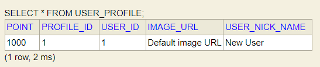

# Team24_BE

## 개발 스프린트 (week5)

### 1. 유저 프로필 리팩토링
- userBody 관련 로직 모두 제거
- week4에서 UserId가 회원정보의 이메일을 받는것을 인지 ,
  회원정보의 id를 받도록 수정

  

### 2. 테스트코드 작성
- controller 
- repository
- serviceImpl 
- 테스트 코드 작성
